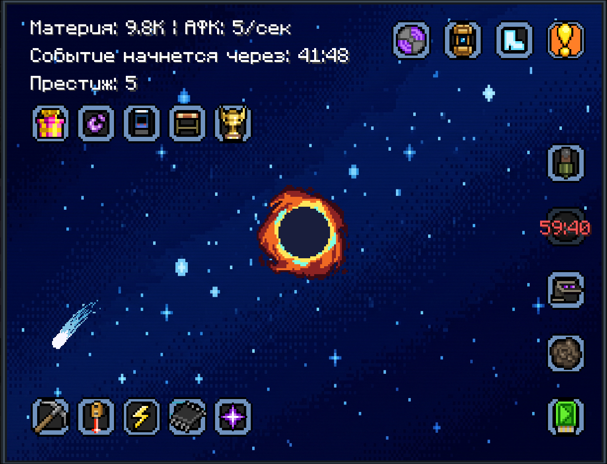
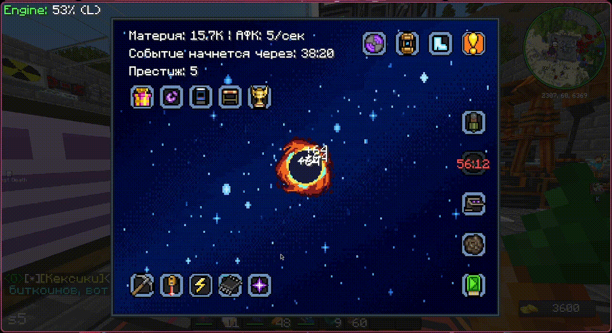

# Async Hyprland Clicker
## Screenshot



An asynchronous Python auto-clicker for Linux running Hyprland. It controls the cursor through Hyprland IPC and sends mouse button events directly to `ydotoold`—without running `hyprctl` or `ydotool` subprocesses for every click.

Three tasks run concurrently through `asyncio.gather()`:

- Scan a rectangle in a snake pattern and click meteorites.
- Repeatedly click the center at `(960, 540)`.
- Click a list of side buttons and upgrades.

A shared `asyncio.Lock` prevents tasks from moving the cursor during another task's click. There is only one cursor, so mouse operations are serialized, not simultaneous.

## Demo




## Requirements

- Linux with an active Hyprland session.
- Python **3.11 or newer** (`asyncio.timeout()` is used).
- A running `ydotoold` daemon with permission to access `/dev/uinput`.
- Permission for your user to access the daemon's Unix socket.
- A typical **64-bit little-endian Linux** environment: the raw event format in this script is `<qqHHi` (24 bytes).

All Python imports are from the standard library. No pip packages are required.

On Arch Linux, install Python and ydotool if needed:

```bash
sudo pacman -S python ydotool
```

Installing ydotool does not necessarily start its daemon. Start/configure `ydotoold` using the service or daemon instructions provided by your package. Service names and socket permissions can vary by installation.

## Setup and launch

In terminal with main dir: ```python -m pip install -r requirements.txt```
Save the script as `main.py`. Run it from a terminal inside your Hyprland session:

```bash
python main.py
```

An optional virtual environment can also be used:

```bash
python -m venv venv_for_clicker
source venv_for_clicker/bin/activate
python main.py
```

Before starting:

1. Open and focus the target application.
2. Position it so the configured coordinates match its buttons.
3. Check the coordinate values below, especially on multi-monitor setups.

The script moves the real desktop cursor and clicks whatever is underneath it. Avoid using it over unrelated windows.

### Stop

Press **Ctrl+C in the terminal running the script**. This is not a global hotkey: if another application has keyboard focus, switch back to the terminal first. You can also terminate the Python process from another terminal.

The code attempts to release the left mouse button in `finally` blocks and cancels the other tasks before closing the shared socket. Forced termination or a daemon failure can prevent normal cleanup.

## Socket configuration

The script obtains these variables from the current session:

| Variable | Purpose |
|---|---|
| `XDG_RUNTIME_DIR` | User runtime directory. |
| `HYPRLAND_INSTANCE_SIGNATURE` | Identifies the active Hyprland instance. |
| `YDOTOOL_SOCKET` | Optional explicit path to the ydotoold socket. |

Hyprland socket locations, checked in order:

```text
$XDG_RUNTIME_DIR/hypr/$HYPRLAND_INSTANCE_SIGNATURE/.socket.sock
/tmp/hypr/$HYPRLAND_INSTANCE_SIGNATURE/.socket.sock
```

For ydotoold, the script first uses `YDOTOOL_SOCKET`, or otherwise `$XDG_RUNTIME_DIR/.ydotool_socket`. If that path does not exist, it falls back to `/tmp/.ydotool_socket`.

If your daemon uses another path:

```bash
export YDOTOOL_SOCKET=/actual/path/to/.ydotool_socket
python main.py
```

The daemon must already be running. The script does not launch it.

## Coordinates and settings

Coordinates are passed directly to Hyprland's `movecursor` dispatcher. They refer to the compositor's desktop layout, not coordinates relative to the application window. Monitor placement, scaling, window position, and application UI changes may require adjustments.

### General settings

| Value | Default | Meaning |
|---|---:|---|
| `HOLD` | `0.003` | Default left-button hold duration in seconds: 3 ms. |
| `STEP` | `60` | Horizontal and vertical spacing between meteorite clicks. |

A 3 ms press may be missed by an application that samples input once per frame. Increase the hold duration if necessary. Longer holds also reduce the maximum possible click rate.

### Meteorite scan: `meteorites()`

| Number | Meaning |
|---|---|
| `465` | Left boundary / starting X. |
| `1360` | Right boundary. |
| `410` | Top boundary / starting Y. |
| `870` | Bottom boundary. |
| `STEP = 60` | Grid spacing. |
| `0.005` | Target time between meteorite click starts: 5 ms. |

The scan starts at `(465, 410)`, travels right, moves down one row, and reverses direction. Both horizontal edges are clicked. The last row is clamped to `y = 870`, even if the step does not land on it exactly. After finishing that row, the scan restarts at the top-left corner.

This samples a grid across the rectangle; it does not click every pixel.

Boundary numbers appear in multiple places in `meteorites()`. Update all relevant occurrences if you change the rectangle.

### Center click: `center()`

```python
await click(ydoo, 960, 540)
```

- `960`: center click X.
- `540`: center click Y.
- `0.05` in `deadline = loop.time() + 0.05`: target interval of 50 ms, approximately 20 clicks per second when the mouse is available.

### Side buttons and upgrades: `BUTTONS`

Use uppercase `BUTTONS` for the coordinate list:

```python
BUTTONS = (
    [(1485, y) for y in range(415, 940, 129)]
    + [(x, 930) for x in range(450, 823, 93)]
)
```

#### Side buttons

```python
[(1485, y) for y in range(415, 940, 129)]
```

- `1485`: fixed X.
- `415`: first Y.
- `940`: exclusive stop value, not a clicked coordinate.
- `129`: vertical spacing.

Actual points:

```text
(1485, 415)
(1485, 544)
(1485, 673)
(1485, 802)
(1485, 931)
```

For a final Y of exactly `930`, use:

```python
[(1485, y) for y in (415, 544, 673, 802, 930)]
```

#### Upgrades

```python
[(x, 930) for x in range(450, 823, 93)]
```

- `930`: fixed Y.
- `450`: first X.
- `823`: exclusive stop value.
- `93`: horizontal spacing.

Actual X values: `450`, `543`, `636`, `729`, `822`.

#### Disable one group

Only upgrades:

```python
BUTTONS = [(x, 930) for x in range(450, 823, 93)]
```

Only side buttons:

```python
BUTTONS = [(1485, y) for y in range(415, 940, 129)]
```

Custom positions:

```python
BUTTONS = [(1485, 415), (1485, 544), (450, 930)]
```

Do not name this list `buttons`: that name belongs to the coroutine.

## Button timing: latest recommended version

The latest fix uses these versions of `click()` and `buttons()`:

```python
async def click(ydoo, x, y, hold=HOLD, settle=0):
    await move(x, y)
    await asyncio.sleep(settle)

    try:
        await button(ydoo, DOWN)
        await asyncio.sleep(hold)
    finally:
        await button(ydoo, UP)


async def buttons(ydoo, lock):
    while True:
        async with lock:
            for x, y in BUTTONS:
                await click(ydoo, x, y, hold=0.05, settle=0.05)
                await asyncio.sleep(0.1)

        await asyncio.sleep(1)
```

| Setting | Meaning |
|---|---|
| `settle=0.05` | Wait 50 ms after moving, before pressing. |
| `hold=0.05` | Hold the left mouse button for 50 ms. |
| `sleep(0.1)` | Wait 100 ms after releasing each button. |
| `sleep(1)` | Wait one second after the entire pass. |

Each button takes roughly **0.2 seconds**, plus IPC and scheduling overhead. A ten-button pass takes roughly two seconds, followed by the one-second pause. The first pass has no deliberate initial delay, though it must acquire the lock.

The lock is held for the **entire pass**, including its per-button pauses. Meteorite and center clicks wait until the pass ends. This is intentional: they cannot pull the cursor away while buttons are being processed.

The extra hold and settle settings apply only to this button task. Meteorite and center clicks still use the default `HOLD` and no added settle delay.

### Difference from the earlier five-second version

The earlier `buttons()` implementation used `deadline = loop.time() + 5` and `deadline += 5`. It waited five seconds before its first pass, then targeted one pass every five seconds, with no extra delay between buttons.

The version above replaces that schedule with an immediate first pass, slower individual button clicks, and a one-second pause between completed passes. Change the final `sleep(1)` to `sleep(5)` if you want a five-second pause **after** each pass; that is not the same as starting a pass every five seconds.

## Functions

| Function | Responsibility |
|---|---|
| `move(x, y)` | Asynchronously requests a cursor move through Hyprland IPC and checks for `ok`. Retries a busy Unix connection queue. |
| `button(ydoo, event)` | Sends one raw button event followed by `SYN_REPORT`. |
| `click(ydoo, x, y, hold=HOLD, settle=0)` | Moves, optionally waits, presses, holds, and releases the left mouse button. Must be called while holding the shared lock. |
| `pause_until(deadline)` | Sleeps until a monotonic deadline, or yields immediately if it has already passed. |
| `meteorites(ydoo, lock)` | Repeats the rectangular snake scan. |
| `center(ydoo, lock)` | Repeatedly clicks `(960, 540)`. |
| `buttons(ydoo, lock)` | Repeatedly clicks every coordinate in `BUTTONS`. |
| `main()` | Opens the daemon socket, creates the shared lock, starts all tasks, and cleans them up. |

### Low-level numbers

| Value | Meaning |
|---|---|
| `<qqHHi` | Binary input-event layout used by this script. |
| `1` in the event type field | `EV_KEY`. |
| `0x110` | `BTN_LEFT`, the left mouse button. |
| Event value `1` / `0` | Press / release. |
| `SYN` with type and code `0` | `EV_SYN` / `SYN_REPORT`, reporting a completed input update. |
| `asyncio.timeout(2)` | Two-second total timeout for a Hyprland move request. |
| Retry sleep `0.001` | One-millisecond yield before retrying a busy connection queue. |
| `sock_recv(..., 64)` | Maximum bytes read at once; this is not a timing setting. |

## Enable or disable tasks

In `main()`:

```python
for job in (meteorites, center, buttons)
```

For meteorites and center only:

```python
for job in (meteorites, center)
```

For buttons only, useful when diagnosing missed clicks:

```python
for job in (buttons,)
```

Keep the trailing comma for a single-item tuple.

## Troubleshooting

### `TypeError: 'function' object is not iterable`

The list and coroutine were both named `buttons`. Use:

```python
BUTTONS = [...]

async def buttons(ydoo, lock):
    # ...
    for x, y in BUTTONS:
        # ...
```

### `Transport endpoint is not connected`

If the traceback points to the Hyprland send operation, keep the patched `move()` implementation that calls nonblocking `connect()` directly and retries `EAGAIN` / `EWOULDBLOCK` with a fresh socket. Also verify the current Hyprland instance and socket path. The error alone does not prove which connection failure occurred.

### Missing socket or permission denied

Check that Hyprland and `ydotoold` are running, the environment variables point to the current session, and your user can access the daemon socket. Configure appropriate daemon/socket permissions rather than blindly running the entire clicker as root.

### Some buttons are missed

1. Run only the `buttons` task to isolate interference.
2. Verify every coordinate manually, including the last side-button Y (`931` by default).
3. Try `hold=0.05` and `settle=0.05`, increasing them if necessary.
4. Keep the lock around the entire series while testing.
5. Check whether the button is enabled, affordable, or on cooldown in the target application.

Increasing the pause between clicks does not lengthen a very short press. No timing setting guarantees that the application will accept every click.

### Click rates are slower than configured

`asyncio` is not a real-time scheduler. IPC overhead, system load, hold duration, and lock contention all affect timing. In particular, the latest button series pauses the other mouse tasks for the duration of the entire pass.
